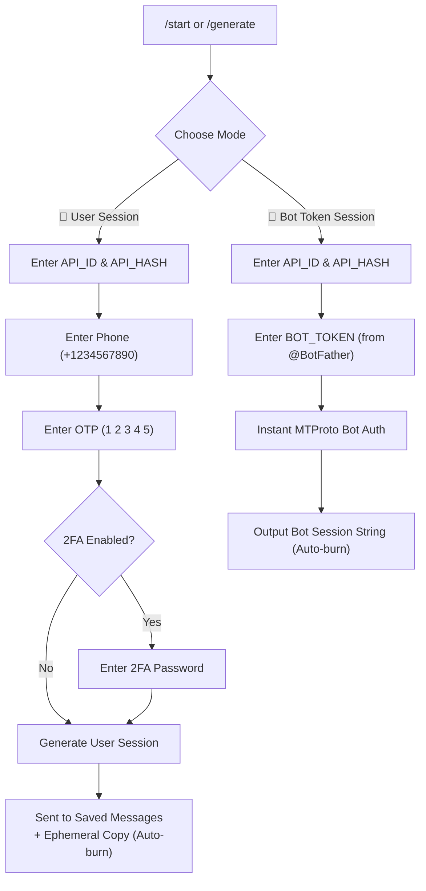

<div align="center">

# ⚡ ZeroSess

### The Modern, Zero-PII Telegram Session String Generator Bot & CLI
**Generate Pyrogram v2, Telethon & Bot Token MTProto Session Strings in Seconds.**

[](https://github.com/saahiyo-cloud/ZeroSess/actions/workflows/ci.yml)
[](https://github.com/saahiyo-cloud/ZeroSess/stargazers)
[](https://github.com/saahiyo-cloud/ZeroSess/network/members)
[](LICENSE)
[](https://www.python.org/)
[](Dockerfile)
[](https://docs.pyrogram.org/)
[](https://docs.telethon.dev/)
[](https://colab.research.google.com/github/saahiyo-cloud/ZeroSess/blob/main/ZeroSess_Colab.ipynb)

<br/>

[🚀 Quick Start](#-instant-run-options) • [✨ Features](#-key-features) • [⚖️ Feature Comparison](#️-feature-comparison) • [☁️ Deployment](#-one-click-deploy) • [🛡️ Security](#-security--zero-pii-guarantee) • [🤝 Contributing](CONTRIBUTING.md)

---

</div>

## 🚀 Instant Run Options

Choose the fastest way for you to generate a session string:

### 1. 📓 In-Browser (Google Colab — Zero Setup)
Generate your session string online in 10 seconds without installing anything:
[](https://colab.research.google.com/github/saahiyo-cloud/ZeroSess/blob/main/ZeroSess_Colab.ipynb)

### 2. 📱 1-Line Termux & Linux CLI (Mobile / Terminal)
Run the interactive wizard directly in your Termux or Linux terminal:
```bash
curl -sSL https://raw.githubusercontent.com/saahiyo-cloud/ZeroSess/main/scripts/generate.sh | bash
```

### 3. 🤖 Self-Host Your Own Telegram Bot
Clone and run your dedicated Telegram Bot in 2 commands:
```bash
git clone https://github.com/saahiyo-cloud/ZeroSess.git
cd ZeroSess && cp .env.example .env && pip install -r requirements.txt && python -m bot
```

---

## ✨ Key Features

- 🧙‍♂️ **Interactive Wizard UI:** Clean step-by-step progress with `Cancel` on every step.
- 🤖 **Dual Mode Support:**
  - **👤 User Account Sessions:** Pyrogram v2 & Telethon (Phone + OTP + 2FA support).
  - **🤖 Bot Token Sessions:** Instant MTProto session generation using BotFather token (No OTP needed).
- 🔍 **Session Validator & Inspector (`/check`):** Safely test any Pyrogram v2 or Telethon session string in-memory to view account status, ID, username, Data Center (DC), and Premium status.
- 🛡️ **Zero PII Logging & In-Memory:** No `.session` or `.sqlite` files written to disk. Pure ephemeral memory.
- 🔥 **Auto-Burn & Ephemeral Output:** Sensitive inputs (phone, OTP, 2FA password, bot tokens) are immediately purged. Final session messages auto-delete after 5 minutes (configurable) with an instant `🗑️ Delete Now` button.
- 🔐 **Saved Messages Delivery:** Sends user session strings directly to your account's **Saved Messages** for safekeeping.
- 🚦 **Smart Rate Limiting:** Built-in sliding-window rate limiter per user to prevent FloodWait and abuse.
- ⚡ **Native Async FSM:** Built using native `pyrogram` filters & `asyncio.Future` — zero memory leaks and no fragile global state.
- 📱 **2FA & FloodWait Handling:** Gracefully handles Two-Factor Authentication passwords and formatted FloodWait recovery timers.
- 📢 **Owner Broadcast & User Analytics (`/broadcast`, `/stats`):** Send announcements (text/media/buttons with optional `-pin`) to all active users with live progress updates, FloodWait handling, and real-time generation metrics.
- 🚪 **Optional MUST_JOIN Gate:** Optional channel membership verification.

---

## ⚖️ Feature Comparison

Why developers choose **ZeroSess** over legacy session generator bots:

| Feature | ⚡ ZeroSess | Old StringSessionBot | TG-String-Session |
| :--- | :---: | :---: | :---: |
| **Pyrogram v2 Support (64-bit ID safe)** | ✅ **Yes (Native)** | ❌ (Pyrogram v1 Only) | ❌ (Outdated) |
| **Telethon v1.41+ Support** | ✅ **Yes** | ✅ Yes | ✅ Yes |
| **Bot Token MTProto Session** | ✅ **Yes (Instant)** | ❌ No | ❌ No |
| **Session String Inspector (`/check`)** | ✅ **Yes (In-Memory)** | ❌ No | ❌ No |
| **Zero-PII & In-Memory (No Disk Files)**| ✅ **100% Ephemeral** | ⚠️ Partial | ❌ Saves to disk |
| **Auto-Burn & Saved Messages Delivery** | ✅ **Yes** | ❌ No | ❌ No |
| **Google Colab 1-Click Run** | ✅ **Yes** | ❌ No | ❌ No |
| **Termux 1-Line Script** | ✅ **Yes** | ❌ No | ❌ No |
| **Docker & 1-Click Cloud Deploy** | ✅ **Railway / Render** | ⚠️ Heroku only | ⚠️ Broken |

---

## ☁️ One-Click Deploy

Deploy your own instance of ZeroSess in under 60 seconds:

| Platform | One-Click Button |
| :--- | :--- |
| **Railway** | [](https://railway.app/template/new?template=https://github.com/saahiyo-cloud/ZeroSess) |
| **Render** | [](https://render.com/deploy?repo=https://github.com/saahiyo-cloud/ZeroSess) |

> **Note:** Provide your `API_ID`, `API_HASH`, and `BOT_TOKEN` in the environment variables settings on your platform.

---

## 📖 User Flow



---

## ⚙️ Environment Variables

| Variable | Required | Default | Description |
| :--- | :---: | :---: | :--- |
| `API_ID` | **Yes** | — | Telegram API ID from [my.telegram.org](https://my.telegram.org) |
| `API_HASH` | **Yes** | — | Telegram API Hash (32 hex characters) |
| `BOT_TOKEN` | **Yes** | — | Telegram Bot Token from [@BotFather](https://t.me/BotFather) |
| `OWNER_ID` | No | `0` | Telegram User ID of the bot owner (for `/stats`) |
| `MUST_JOIN` | No | — | Channel username (e.g. `@MyChannel`) to force join |
| `SUPPORT_CHAT` | No | — | Support group username or link shown in `/about` |
| `SESSION_TIMEOUT` | No | `300` | Timeout per step in seconds (default: 5 min) |
| `RATE_LIMIT_COUNT` | No | `3` | Maximum generations allowed per window |
| `RATE_LIMIT_WINDOW`| No | `3600` | Window duration in seconds (default: 1 hour) |
| `AUTO_DELETE_SECONDS`| No | `300` | Auto-deletion timer for session messages |

---

## 🛡️ Security & Zero-PII Guarantee

1. **In-Memory Guarantee:** ZeroSess never writes session tokens, phone numbers, or passwords to local disk or SQLite files.
2. **Ephemeral Purge:** User-sent OTPs and 2FA passwords are removed immediately from the chat history where bot permissions allow.
3. **Session Revocation:** If you ever suspect a session string is leaked, immediately terminate it from:
   `Telegram Settings → Devices → Terminate All Other Sessions` (or use `/destroy` in the bot for guided steps).

---

## 🧩 Tech Stack

- **Frameworks:** [Pyrogram v2.0.106](https://docs.pyrogram.org/) & [Telethon v1.41.2](https://docs.telethon.dev/)
- **Encryption Accelerator:** `tgcrypto`
- **Runtime:** Python 3.10+
- **Containerization:** Docker & Docker Compose

---

## 🌟 Show Your Support

If you find **ZeroSess** helpful or use it in your projects:
- Give this project a **Star ⭐** to support future updates!
- **Fork** the repository to customize or contribute new features.
- Share with your fellow Telegram developers!

[](https://github.com/saahiyo-cloud/ZeroSess/stargazers)
[](https://github.com/saahiyo-cloud/ZeroSess/fork)

---

## 📄 License

Distributed under the **MIT License**. See [`LICENSE`](LICENSE) for more information.
