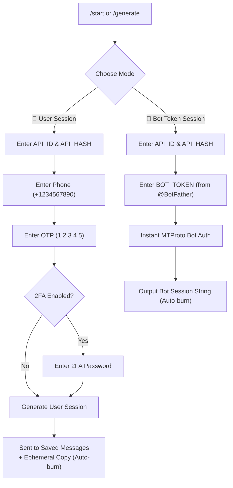

<div align="center">

# ⚡ ZeroSess

### Production-Grade Telegram Session String Generator Bot

[](https://github.com/saahiyo-cloud/ZeroSess/actions/workflows/ci.yml)
[](https://opensource.org/licenses/MIT)
[](https://www.python.org/)
[](Dockerfile)
[](https://docs.pyrogram.org/)
[](https://docs.telethon.dev/)

**Secure Telegram bot to generate Pyrogram v2 & Telethon session strings with a guided wizard UI, auto-burn, and zero PII logging.**

[Quick Start](#-quick-start) • [Features](#-features) • [Deployment](#-one-click-deploy) • [Security Policy](#-security--privacy) • [Tech Stack](#-tech-stack)

---

</div>

## ✨ Key Features

- 🧙‍♂️ **Interactive Wizard UI:** Clean Step 1/5 (User) and Step 1/3 (Bot) progress with `Cancel` on every step.
- 🤖 **Dual Mode Support:**
  - **👤 User Account Sessions:** Pyrogram v2 & Telethon (Phone + OTP + 2FA support).
  - **🤖 Bot Token Sessions:** Instant MTProto session generation using BotFather token (No OTP needed).
- 🔍 **Session Validator & Inspector (`/check`):** Safely test any Pyrogram v2 or Telethon session string in-memory to view account status, ID, username, Data Center (DC), and Premium status.
- 🛡️ **Zero PII Logging & In-Memory:** No `.session` or `.sqlite` files written to disk. Pure ephemeral memory.
- 🔥 **Auto-Burn & Ephemeral Output:** Sensitive inputs (phone, OTP, 2FA password, bot tokens) are immediately purged. Final session messages auto-delete after 5 minutes (configurable) with an instant `🗑️ Delete Now` button.
- 🔐 **Saved Messages Delivery:** Sends user session strings directly to your account's **Saved Messages** for safekeeping.
- 🚦 **Smart Rate Limiting:** Built-in sliding-window rate limiter per user to prevent FloodWait and abuse.
- ⚡ **Native Async FSM:** Built using native `pyrogram` filters & `asyncio.Future` — zero memory leaks and no fragile global state.
- 📱 **2FA & FloodWait Handling:** Gracefully handles Two-Factor Authentication passwords and formatted FloodWait recovery timers.
- 📢 **Owner Broadcast & User Analytics (`/broadcast`, `/stats`):** Send announcements (text/media/buttons with optional `-pin`) to all active users with live progress updates, FloodWait handling, and real-time generation metrics.
- 🚪 **Optional MUST_JOIN Gate:** Optional channel membership verification.

---

## 🚀 Quick Start

### 1. Prerequisites
- **API_ID & API_HASH:** Get them at [my.telegram.org](https://my.telegram.org) → *API development tools*.
- **BOT_TOKEN:** Create a bot via [@BotFather](https://t.me/BotFather) → `/newbot`.

### 2. Local Setup

```bash
# Clone the repository
git clone https://github.com/saahiyo-cloud/ZeroSess.git
cd ZeroSess

# Copy configuration
cp .env.example .env

# Install dependencies
pip install -r requirements.txt

# Run the bot
python -m bot
```

### 3. Docker Deployment

```bash
# Build and run in detached mode
docker compose up --build -d

# View live logs
docker logs -f zerosess-bot-1
```

---

## ☁️ One-Click Deploy

Deploy your own instance of ZeroSess in under 60 seconds:

| Platform | One-Click Button |
| :--- | :--- |
| **Railway** | [](https://railway.app/template/new?template=https://github.com/saahiyo-cloud/ZeroSess) |
| **Render** | [](https://render.com/deploy?repo=https://github.com/saahiyo-cloud/ZeroSess) |

> **Note:** Fill in `API_ID`, `API_HASH`, and `BOT_TOKEN` in the environment variables settings on your platform.

---

## 📖 User Flow



---

## ⚙️ Environment Variables

| Variable | Required | Default | Description |
| :--- | :---: | :---: | :--- |
| `API_ID` | **Yes** | — | Telegram API ID from [my.telegram.org](https://my.telegram.org) |
| `API_HASH` | **Yes** | — | Telegram API Hash (32 hex characters) |
| `BOT_TOKEN` | **Yes** | — | Telegram Bot Token from [@BotFather](https://t.me/BotFather) |
| `OWNER_ID` | No | `0` | Telegram User ID of the bot owner (for `/stats`) |
| `MUST_JOIN` | No | — | Channel username (e.g. `@MyChannel`) to force join |
| `SUPPORT_CHAT` | No | — | Support group username or link shown in `/about` |
| `SESSION_TIMEOUT` | No | `300` | Timeout per step in seconds (default: 5 min) |
| `RATE_LIMIT_COUNT` | No | `3` | Maximum generations allowed per window |
| `RATE_LIMIT_WINDOW`| No | `3600` | Window duration in seconds (default: 1 hour) |
| `AUTO_DELETE_SECONDS`| No | `300` | Auto-deletion timer for session messages |

---

## 🛡️ Security & Privacy

1. **In-Memory Guarantee:** ZeroSess never writes session tokens, phone numbers, or passwords to local disk or SQLite files.
2. **Ephemeral Purge:** User-sent OTPs and 2FA passwords are removed immediately from the chat history where bot permissions allow.
3. **Session Revocation:** If you ever suspect a session string is leaked, immediately terminate it from:
   `Telegram Settings → Devices → Terminate All Other Sessions` (or use `/destroy` in the bot for guided steps).

---

## 🧩 Tech Stack

- **Frameworks:** [Pyrogram v2.0.106](https://docs.pyrogram.org/) & [Telethon v1.41.2](https://docs.telethon.dev/)
- **Encryption Accelerator:** `tgcrypto`
- **Runtime:** Python 3.10+
- **Containerization:** Docker & Docker Compose

---

## 📁 Repository Structure

```
ZeroSess/
├── .github/
│   ├── ISSUE_TEMPLATE/     # Bug report & feature request forms
│   ├── workflows/ci.yml     # GitHub Actions CI workflow
│   └── pull_request_template.md
├── bot/
│   ├── __init__.py
│   ├── __main__.py          # Entrypoint & lifecycle management
│   ├── config.py            # Environment validation & sanitization
│   ├── fsm.py               # State machine & async step waiter
│   ├── strings.py           # Text templates & inline keyboards
│   ├── generators/
│   │   ├── pyrogram_gen.py  # Pyrogram v2 in-memory auth
│   │   └── telethon_gen.py  # Telethon in-memory auth
│   └── plugins/
│       ├── start.py         # /start, /help, /about handlers
│       ├── generate.py      # Multi-step generation wizard
│       ├── stats.py         # Admin stats & metrics
│       └── destroy.py       # Session termination guide
├── .env.example
├── .gitignore
├── app.json                 # Deployment schema
├── CONTRIBUTING.md          # Contribution guidelines
├── Dockerfile
├── docker-compose.yml
├── LICENSE                  # MIT License
├── Procfile
├── README.md
├── render.yaml
├── requirements.txt
├── runtime.txt
└── SECURITY.md              # Security policies & disclosures
```

---

## 📄 License

Distributed under the **MIT License**. See [`LICENSE`](LICENSE) for more information.
